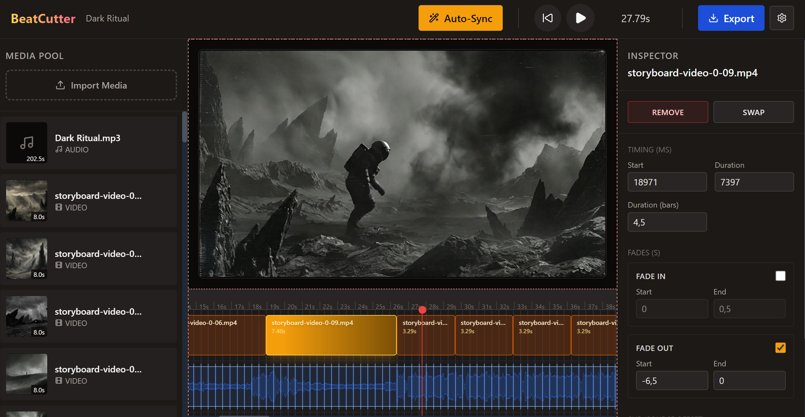

## Setup
1. Install dependencies:
   `npm install`
2. Run the app (Electron + Vite):
   `npm run dev`

## Build
- Build renderer + Electron main process:
  `npm run build`
- Build with relative asset paths for packaging:
  `npm run build:electron`
- Create an unpacked build (useful for testing):
  `npm run pack`
- Create a Windows installer:
  `npm run dist`

## Usage
1. Import media via the Media Pool (audio + video).
   - Importing the main audio track analyzes beats and creates the audio timeline.
2. Open Auto-Sync, enter BPM / clip length / intro skip (or use Gemini in Options), then apply to generate video cuts.
3. Select timeline segments to tweak timing, fades, and source offsets in the Inspector.
4. Scrub or play from the header controls; zoom the timeline with Ctrl + mouse wheel or Ctrl + / Ctrl -.
5. Export from the header; the MP4 is saved next to the first video clip.
